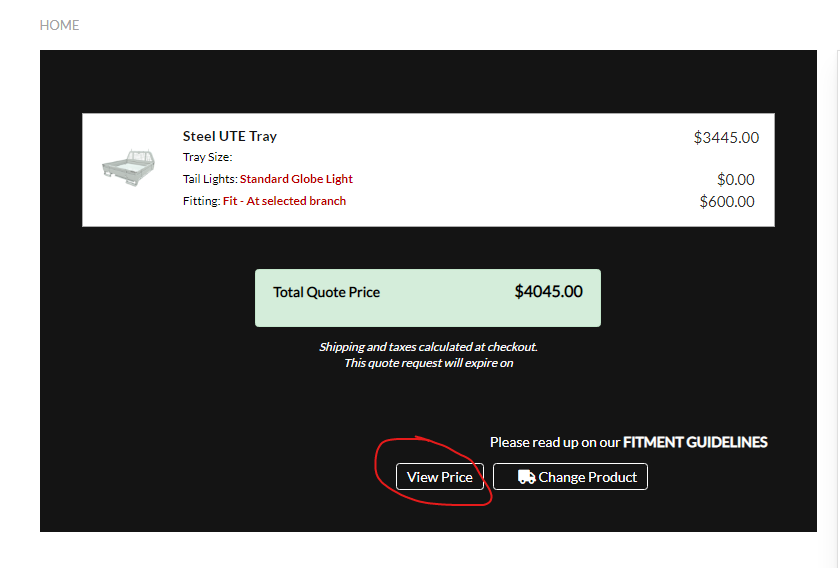

# Piranha Offroad Installation

**Tech Stacks**

1. Bigcommerce Stencil/CLI
2. Bigcommerce Theme (HTML5/CSS3/Bootstrap/Handlebars/NodeJS/VanillaJS)
3. Laravel 8.x.x

---

**1.0 - Dependencies**

Please install the following :

**For Piranha Theme:**

- Node.js 14 and npm - later versions not currently supported on Windows
- [Stencil CLI](https://developer.bigcommerce.com/stencil-docs/003c4b2e8108c-installing-stencil-cli#installing-on-windows)
- Piranha Store Theme Source Files

**For Piranha CRM/API**

- PiranhaCRM Source File
- [Laragon](https://github.com/leokhoa/laragon/releases/download/6.0.0/laragon-wamp.exe)

#

#

#

#

**1.1 - Setup**

Go to the root folder of Laragon Installation and and move the 2 code bases (PiranhaCMR and Piranha Theme) in www folder. In my case it's **C:\Laragon\www**. e.g:


Once dependency installation for local development environment is successful and complete, next is you will install the dependencies for each source files.

**Note: When using the Composer/Artisan CLI please use the terminal provided by the Laragon Application**

* for piranha-crm run the following:
  * `composer install`
* for piranha-theme run the following:
  * `npm install -g @bigcommerce/stencil-cli`
  * `stencil init` - this command will ask for:
    * Piranha Offroad production url
    * Piranha Offroad Theme Token
    * Local Port (usually the port 3000)

#

#

#

#

**1.2 - Database**

Database is only applicable for piranha-crm, you will also need to setup database connection in your `.env` file which can be found in the `piranha-crm` root directory, if not present, create it your own. Copy the following code to the `.env` file:

```APP_NAME=Laravel
APP_ENV=local
APP_KEY=base64:mFda2DPFlo4+70qeQoLpUcDA7YwCG3L4ENcjPfwHeFI=
APP_DEBUG=true
APP_URL=http://localhost
LOG_CHANNEL=stack
LOG_LEVEL=debug
DB_CONNECTION=mysql
DB_HOST=127.0.0.1
DB_PORT=3306
DB_DATABASE=piranhat_offroad
DB_USERNAME=root
DB_PASSWORD=
BROADCAST_DRIVER=log
CACHE_DRIVER=file
QUEUE_CONNECTION=database
SESSION_DRIVER=file
SESSION_LIFETIME=120
MEMCACHED_HOST=127.0.0.1
REDIS_HOST=127.0.0.1
REDIS_PASSWORD=null
REDIS_PORT=6379
MAIL_MAILER=smtp
MAIL_HOST=mailhog
MAIL_PORT=1025
MAIL_USERNAME=null
MAIL_PASSWORD=null
MAIL_ENCRYPTION=null
MAIL_FROM_ADDRESS=null
MAIL_FROM_NAME="${APP_NAME}"
AWS_ACCESS_KEY_ID=
AWS_SECRET_ACCESS_KEY=
AWS_DEFAULT_REGION=us-east-1
AWS_BUCKET=PUSHER_APP_ID=
PUSHER_APP_KEY=
PUSHER_APP_SECRET=
PUSHER_APP_CLUSTER=mt1
MIX_PUSHER_APP_KEY=""
MIX_PUSHER_APP_CLUSTER=""
```

#

#

#

#

**1.3 - Running Development Server**

Although Laravel Server is used only when dealing with `https://piranhoffroad.com.au/build-your-quote` page it is also ideal to run the server together with Piranha Offroad Theme Server at the same just to enable full functionality of the Piranha Offroad local development environment.

1. Piranha Theme Server
   * `stencil start`
2. Piranha CRM Server
   * `php artisan serve`

#

#

#

#

# Development

During the development it is a good practice to separate custom code from the codes that is builtin to the theme files. In this project we are dealing with 2 custom codes:

* Custom Scripts
* Custom Pages

1. Here we utelize injecting the custom scripts once the Website is loaded. Custom scripts are found in`\assets\js\ipsumph`. eg:


and is injected to the global.js script which can be found in ` \assets\js\theme\global.js` eg:


2. Custom pages are also found in`\templates\pages\custom\page` eg:


1. `bookingcart.js`

   * This will override the default cart page. Specifically for Trays and Canopy Products
2. `calendar.js`

   * Handles calendar events and functionality. see Teamup Calendar
   * 
3. `quotation.js`

   * This is the base script for build your quote page
4. `quotesummary.js`

   * This handles when NPO number is present in the URL for previewing. eg:`https://www.piranhaoffroad.com.au/build-your-quote/?quoteid=NPO61979`
5. `validation.js`

   * This is input validator for required fields

### Booking Rules

* System should only accept 1 tray / canopy fitment per day.
* System should not accept fitment jobs on weekends or holidays.
* Always assign sub-calendar Web to job order events on the calendar, as this serves as the main connection between the online web calendar and branch teamup calendar. NOTE: Do not delete the Web sub-calendar on any branch.
* Always create events for holidays using the Holiday sub-calendar or Web sub-calendar to disable the date from the online web calendar.
* An event should be created on the branch teamup calendar for the job order.
  * Event should automatically assign calendar Web
  * Event Title should be the booked product
  * CustomerName - should contain the customer name
  * Job_Description - should contain the following details
    * Vehicle Type - make model year
    * Product

      * For trays: tray size and color
      * Tail lights
    * Accessories selected
    * Size
    * Reference ID
    * Order ID
    * Customer email
    * Remaining Balance
* Online web calendar should display the earliest available date based on lead time provided by each branch (*Please see Branch Teamup Calendar above for reference)

#

#

#

#

# Sending Emails

Quotation emails are sent right after you click `view price` button at the end of filling up vehicle information:



Sending of emails has the following condition:

1. Sent a quotation email to the customer
2. Sent a copy of quotation email to the branch the customer selected in the form.

#

#

#

#

# Teamup Calendar

Teamup calendar is a 3rd party tool that manage fitment schedules of the paid booking, once the customer paid a fitment deposit or checked out the products from the cart, it will automatically record the information to the teamup calendar via an api:

Teamup endpoints:

Also please see: `Development: 3. calendar.js`

The code below can be found in the PiranhaCRM api:

```

"Dandenong, VIC 3175" and "Keysborough, VIC 3173"

     subcalendar = "8888564";
     api_client = 'https://api.teamup.com/ks7dof1xsosn58w8z7/events';


"Boronia, VIC 3155"

     subcalendar = "8892120";
     api_client = 'https://api.teamup.com/ksp6toacwrzr9m4j3d/events';


"Laverton, VIC 3026"
     subcalendar = "8887403";
     api_client = 'https://api.teamup.com/kscbpp2a1tzka2hye7/events';


"Sydney, NSW 2170"
     subcalendar = "8887414";
     api_client = 'https://api.teamup.com/ks5mr8zheha6b8azak/events';


"Brisbane - Banyo, QLD 4014"
     subcalendar = "8887420";
     api_client = 'https://api.teamup.com/ksmmq8o3vkwjfzkga8/events';


"Brisbane - Northgate, QLD 4013"
     subcalendar = "8927402";
     api_client = 'https://api.teamup.com/ksrzgxwu5v756cehq3/events';


"Perth, WA 6090"
     subcalendar = "8887436";
     api_client = 'https://api.teamup.com/ksdmenvm1obz1a1r3r/events';


```

Note: You can visit each calendar by removing the api subdomain and the events path: eg. `https://teamup.com/ks7dof1xsosn58w8z7/`

#

#

#

#

# Script Manager - Trigger Points

Since we cant directly use bigcommerce functionality, we create trigger points via js script that is store in the bigcommerce script manager which can be found in: `Storefront > Script Manager` . The following are:

`Confirm Fitting Schedule` This script will be fired when the order is confirmed. First, it will create a record to teamup calendar and then update the order status to "Awaiting fullfilment".

`Sales Notification Pop Up` It is a static script that will popup like this:


See full documentation here: [Using Script Manager (bigcommerce.com)](https://support.bigcommerce.com/s/article/Using-Script-Manager?language=en_US)

#

#

#

#

# Web Pages

When creating webpages found in `Storefront > Web Pages`, same as script we can  create addition custom page from bigcommerce dashboard or, create directly to your theme files. the following are the pages that is made in the bigcommerce dashboard.

* **Product Result** - search results page for Search by Year, Make, Model App
* **Page under Maintenance** - page used for page maintenance
* **Quote Expired** - page used for booking system if a quote is expired
* **Store Pick Up Requirements** - page that contains store pick up requirements for order with Pay and Pick up in Store payment method
* **Tray and Canopy** - UTE Trays and Canopies landing page
* **Fitting Guidelines** - page that contains the fitment guidelines for customers, this page link is included in the booking system email notifications
* **Piranha TV** - this is the Piranha TV page of the website
* **Privacy** - privacy page
* **Shipping and Return Policy** - contains shipping and return policy of piranha website
* **Terms and Conditions** - contains terms and conditions of website
* **Products and subpages** - these pages were linked to product categories links from Products menu
* **Thank you** - thank you page for General Quote Form
* **Get Quote** - contains the General Quote Form of the website.
* **Info Centre** - contains info centre page of the website and has subpages Dual Battery Management Article and Why Piranha Management is better
* **About Us** - about us page of the website and has subpage Distributors
* **Warranty** - contains the warranty page of the website
* **Build Your Quote** - this contains the booking system form of the website.
* **Contact Us** - this is the contact us page that contains the contact form of the website.
  * Contact Us submissions are stored in server database in piranhat_offroad tbl_contact_us table fdgh

#

#

#

#

# CRON JOBS

Cron Jobs will fulfill the automation of sales followup email. also this functionality lies in the PiranhaCRM source code. In the CPANEL dashboard you will find in the menu `Cron Jobs`. Just click on it and you will see list of jobs that is registered specificly for piranha offroad build your quote page.


1. This Job will run daily at 11:51 in the morning. The main function is to query all the bookings the aged 15days and will send and update to the customer that they have a quotation that is currently available.
2. The 2nd,3rd and 4th Job is for the sending of email. PHP by nature is not async, so we need the help of CRON Jobs to send emails in queue to improve speed. Please refer:

In `app/Http/Controllers/API/QuoteProductsController.php`

```
 $job1 = new SendQuoteEmail(collect($request),$totalprodprice,$quotationprice,$featitem,$quoteid,"client",$features,$featpricequery,$serviceprice);
            $this->dispatch($job1);
   
            $job2 = new SendQuoteEmail(collect($request),$totalprodprice,$quotationprice,$featitem,$quoteid,"branch",$features,$featpricequery,$serviceprice);
            $this->dispatch($job2);
```

`$job1` is for sending the email to clients

`$job2` is for sending the email to whatever branch the customer just selected in the quotation information

`JOB class` can be found here:`app/Http/Jobs`


#

#

#

#

# Setup - Local vs Production

In Local environment there is no source_files folder.


In Production all of the files are need to be moved to source_files folder


#

#

#

#

# Bigcommerce Pushing and Pulling Stencil Theme from production server

Stencil Push and Pull are usefull commands when you have to work simultaneously with the production files.

please refer:


| COMMAND                                                                                                                     | DESCRIPTION                                                                                                                                                                                         |
| ----------------------------------------------------------------------------------------------------------------------------- | ----------------------------------------------------------------------------------------------------------------------------------------------------------------------------------------------------- |
| [init](https://developer.bigcommerce.com/stencil-docs/ZG9jOjIyMDcwMg-stencil-cli-options-and-commands#stencil-init)         | Interactively creates a`.stencil` file or `secrets.stencil.json` and `config.stencil.json` files (if using Stencil V3.1 release or later), which configures how to run a BigCommerce store locally. |
| [start](https://developer.bigcommerce.com/stencil-docs/ZG9jOjIyMDcwMg-stencil-cli-options-and-commands#stencil-init)        | Starts up the BigCommerce storefront local development environment, using theme files in the current directory and data from the live store.                                                        |
| [bundle](https://developer.bigcommerce.com/stencil-docs/ZG9jOjIyMDcwMg-stencil-cli-options-and-commands#stencil-bundle)     | Bundles up the theme into a structured`.zip` file, which can be uploaded to BigCommerce.                                                                                                            |
| [pull](https://developer.bigcommerce.com/stencil-docs/ZG9jOjIyMDcwMg-stencil-cli-options-and-commands#stencil-pull)         | Pulls the configuration from the active theme on your live store and updates your local configuration.                                                                                              |
| [download](https://developer.bigcommerce.com/stencil-docs/ZG9jOjIyMDcwMg-stencil-cli-options-and-commands#stencil-download) | Downloads the theme files from the active theme on your live store, overwriting local files if desired.                                                                                             |
| [push](https://developer.bigcommerce.com/stencil-docs/ZG9jOjIyMDcwMg-stencil-cli-options-and-commands#stencil-push)         | Bundles the theme into`.zip` file; then directly uploads the `.zip` to BigCommerce.                                                                                                                 |
| [release](https://developer.bigcommerce.com/stencil-docs/ZG9jOjIyMDcwMg-stencil-cli-options-and-commands#stencil-release)   | Creates a new release in a theme's GitHub repository.                                                                                                                                               |
| [help](https://developer.bigcommerce.com/stencil-docs/ZG9jOjIyMDcwMg-stencil-cli-options-and-commands#stencil-help)         | Displays help and returns all the options available to use for the specified command.                                                                                                               |

#

#

#

#

# PiranhaCRM API Enpoints


These are the endpoints that is use in the entire build-your-quote process. You may see the functionality as you go through the development. Please refer:

```


Route::patch('/bigcommerce/update-order-status/{orderid}', [App\Http\Controllers\API\BigcommerceController::class, 'update_order_status']);

Route::get('/bigcommerce/product/{productid}', [App\Http\Controllers\API\BigcommerceController::class, 'bigcommerce_getproduct']);

Route::get('/mail/unsubscribe/{email}', [App\Http\Controllers\API\MailController::class, 'mail_unsubscribe']);


Route::get('/mail/resubscribe/{email}', [App\Http\Controllers\API\MailController::class, 'mail_resubscribe']);


Route::get('/quote-products', [App\Http\Controllers\API\QuoteProductsController::class, 'quote_products']); 


Route::get('/quote-vehiclemake', [App\Http\Controllers\API\QuoteProductsController::class, 'quote_vehiclemake']); 


Route::get('/quote-vehiclemodel/{vmake}', [App\Http\Controllers\API\QuoteProductsController::class, 'quote_vehiclemodel']); 


Route::get('/quote-branches', [App\Http\Controllers\API\QuoteProductsController::class, 'quote_branches']); 


Route::get('/quote-services', [App\Http\Controllers\API\QuoteProductsController::class, 'quote_services']); 


Route::get('/quote-vehicleyear', [App\Http\Controllers\API\QuoteProductsController::class, 'quote_vehicleyear']); 


Route::get('/quote-vehiclefeature', [App\Http\Controllers\API\QuoteProductsController::class, 'quote_vehiclefeature']); 


Route::get('/quote-vehicleaccessories/{product}', [App\Http\Controllers\API\QuoteProductsController::class, 'quote_vehicleaccessories']); 


Route::post('/quote-booking/view-price', [App\Http\Controllers\API\QuoteProductsController::class, 'quote_booking']);


Route::post('/quote-booking/record-paintinfo/{refid}', [App\Http\Controllers\API\QuoteProductsController::class, 'record_paintinfo']);


Route::get('/quote-traycolors/{trayname}', [App\Http\Controllers\API\QuoteProductsController::class, 'quote_traycolors']); 


Route::get('/quote-windowtypes', [App\Http\Controllers\API\QuoteProductsController::class, 'quote_windowtypes']); 


Route::get('/quote-canopysizes/{door}/{finish}', [App\Http\Controllers\API\QuoteProductsController::class, 'quote_canopysizes']); 


Route::post('/add-to-cart/{quoteid}', [App\Http\Controllers\API\QuoteProductsController::class, 'add_to_cart']); 


Route::get('/add-to-cart/{quoteid}', [App\Http\Controllers\API\QuoteProductsController::class, 'add_to_cart_1']); 


Route::get('/quote-info/{quoteid}', [App\Http\Controllers\API\QuoteProductsController::class, 'quote_information']); 


Route::get('/quote-remaining/{quoteid}', [App\Http\Controllers\API\QuoteProductsController::class, 'quote_updateremaining']); 


Route::get('/quote-confirmation/{quoteid}/{orderid}', [App\Http\Controllers\API\QuoteProductsController::class, 'quote_bookconfirmation']); 
```
